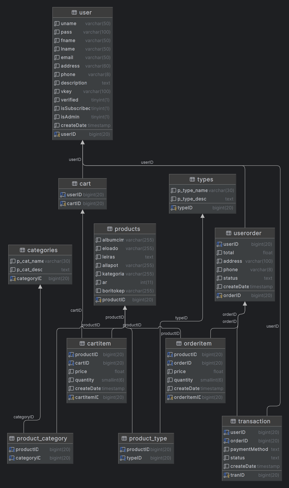

# Funkcionális specifikáció

## Bevezetés

A megrendelő részéről kaptunk néhány weboldal linket, amihez hasonlót szeretne a főbb funkciókkal.

## Célok

A weboldal elsődleges célja lemezek bemutatása rendezhetően és az egyszerű vásárlási lehetőség.

A vásárláshoz a vevőknek regisztrációra van szükség, vásárolni kizárólag regisztrált felhasználóknak szabad, de a
későbbiekben is visszatérhetnek az oldalra.

A vásárlói adatbázisból elérhetők az e-mail adatok, ahova megkeresések, értesítések küldhetők.

A megrendelő egy eladói profillal tudjon belépni és űrlapszerűen újabb lemezeket felvinni, módosítani, törölni.

Vevő: kereshet, rendezhet és megrendelhet, valamint kapcsolatba léphet az eladóval

Eladó: új terméket vehet fel, módosíthat, törölhet

## Jelenlegi helyzet

Megrendelőnk jelenleg nem rendelkezik semmilyen weboldallal, jellemzően a Facebook Marketplace-t használja
értékesítéshez, ahol számos csaló és szélhámos keseríti meg a dolgát. Erre szeretne megoldást.

A felmerülő problémák megoldásai:

Átlátható, egyszerűen kezelhető felület mind az eladónak, mind a vevőknek.

A potenciális visszaélések kiszűrésének minimalizálása kötelező regisztrációval, valamint előre utalással.

Rendezhető, kategorizálható terméklista.

Egyszerű vásárlási folyamat.

Fenntartási költség minimalizálás.

## Követelménylista

Felhasználói szintek:

- látogatóként a terméklista nem elérhető
- regisztrált felhasználók láthatják a terméklistát és az árakat is, valamint vásárolhatnak
- eladóként elérhető a termék adminisztrációs felület is
- eladó tudja a felhasználókat is adott esetben törölni

## Használati esetek

Szereplők:

Eladó

Vevő

Látogató

Tevékenységek:
Eladó:

- Jogosultsága alapbeállítás a rendszerben
- Bejelentkezés eladóként, mindenhez hozzáfér
- Felhasználókat tud törölni
- Új termékeket tud a terméklistához hozzáadni
- Meglévő termékeket tud a terméklistában módosítani
- Meglévő terméket tud a terméklistáról törölni

Vevő:

- Regisztráció
- Bejelentkezés vevőként
- Termékek megtekintése
- Vásárlói kosárhoz termék hozzáadása
- Termékek módosítása a kosárban
- Termékek eltávolítása a kosárból
- Megrendelés véglegesítése
- Elfelejtett jelszó esetén új kérése
- Jelszó változtatása

## Képernyőtervek

Kezdőoldal látványos kép elemekkel, de alapvetően nem kattintható, csak egy ízelító a kínálatból és a tevékenységről.

Fejléc:
Cég logo baloldalon a fejlécben, minden oldalon látható.
Fejlécben a menüsor, benne Kezdőoldal/Termékek/Új termék hozzáadása/Készítsd el a saját
bakelited/Rólunk/Kapcsolatfelvétel. Új termék hozzáadása csak az Eladó felhasználónál látszik.
Fejléc jobb oldalon kattintható Kosár és Felhasználó ikonok.
Bejelentkezés után válik elérhetővé a terméklista és Vevő felhasználók részére a vásárlási lehetőség, addig „A termékek
megtekintéséhez regisztráció és bejelentkezés szükséges” tájékoztató látható.
A menüsorban bejelentkezés ikonnal lehet a felhasználóknak bejelentkezni.
A kosár ikonra kattintva érhető el a vevők által már kosárba helyezett termékek
A vásárlási folyamat illusztrált bemutatása.
Néhány ízelítő lemez a kínálatból, Youtube vagy Spotify linkkel a belehallgatáshoz.
A lábjegyzetben a szokásos hivatkozások (Adatkezelési szabályzat, Felhasználói feltételek, Támogatás stb.)

## Forgatókönyvek

Regisztráció:
Az oldal betöltése után a kezdőképernyőn a Felhasználó ikonra kattintva hagyományos bejelentkezési
képernyő jelenik meg, ami felhasználói nevet és jelszót kér, valamint ha még valaki nem felhasználó, akkor ennek
segítségével tud vevőként regisztrálni. Amennyiben új felhasználóként regisztrál, akkor egy új nyomtatványon meg kell
adnia a Felhasználói nevét, Vezetéknevét, Keresztnevét, e-mail címét, jelszavát, jelszót mégegyszer valamint egy
reCAPTCHA-t az automatizált visszaélések miatt.
Az e-mail címre kiküldésre kerül egy valós e-mail címet megerősítő kérés, utána válik aktívvá a felhasználó.

Bejelentkezés:
Az oldal elindítás után, a navigációs sávon a Bejelentkezés gomb segítségével tudunk belépni a fiókunkba,
amennyiben már előtte regisztráltunk egyet.
A gomb lenyomása után megadhatjuk a bejelentkezéshez szükséges adataink (Felhasználónév, Jelszó), és amennyiben helyes
adatokat adtunk meg, úgy a Bejelentkezés gomb lenyomásával sikeresen beléphetünk a fiókunkba.
Elfelejtett jelszó esetén az Elfelejtette jelszavát? hivatkozásra kattintva kérhetjük a jelszó visszaállítását az e-mail
címre küldött hivatkozással.

Termék kiválasztása:
Sikeres bejelentkezést követően, a menüsorban a Termékek menüpontban tud a Vevő a termékek között böngészni,
kategóriákat rendezni és sorbarendezni.
Vevő esetén kosárba helyezés/eltávolítás/módosítás és megrendelés lehetőséggel.
Eladó felhasználó esetén új termékek felvitelére, meglévők módosítására és törlésére is van lehetőség.

Készítsd el a saját bakelited! menüpont
Instrukciókat tartalmaz a kapcsolatfelvételhez és a szükséges formátumról valamint a lemezkészítés folyamatáról,
alapvetően e-mail kommunikáción keresztül az eladóval.

Rólunk menüpont
A vevő részletes bemutatkozó oldala, néhány lemezritkaság bemutatása, az oldal alján elérhetőség Google maps linkkel és
kapcsolatfelvételi űrlap.

Kapcsolat menüpont
Elérhetőség Google maps linkkel és kapcsolatfelvételi űrlap

## Adatbázis felépítés

A Vinylmaster webshop által hazsnált MySQL adatbázis, a vinylmasterdb, egy olyan adatbázis-rendszer, amelyet úgy
terveztünk, hogy kezelje az online hanglemezbolt adatait. A struktúra több táblát tartalmaz, mint például products, 
categories, product_category, types, product_type, user, cart, cartitem, userorder, orderitem, és transaction.

Ebben a rendszerben a products tábla tárolja az eladásra kínált hanglemezek adatait, beleértve az előadó nevét, az album
címét, leírását, állapotát, kategóriáját, árát, és a borító képét. A categories és types táblák különböző kategóriákat
és típusokat definiálnak, amelyeket aztán a product_category és product_type táblákon keresztül kapcsolnak össze a
termékekkel.

A user tábla a felhasználók adatait tárolja, beleértve a felhasználónevet, jelszót, nevet, e-mail címet, címet,
telefonszámot, és további információkat. A vásárlási folyamatot a cart, cartitem, userorder, orderitem, és transaction
táblák kezelik, amelyek a kosárba helyezett termékeket, a megrendeléseket és a tranzakciókat követik nyomon.

Az alábbi ábra mutatja az adatbázis felépítését:

