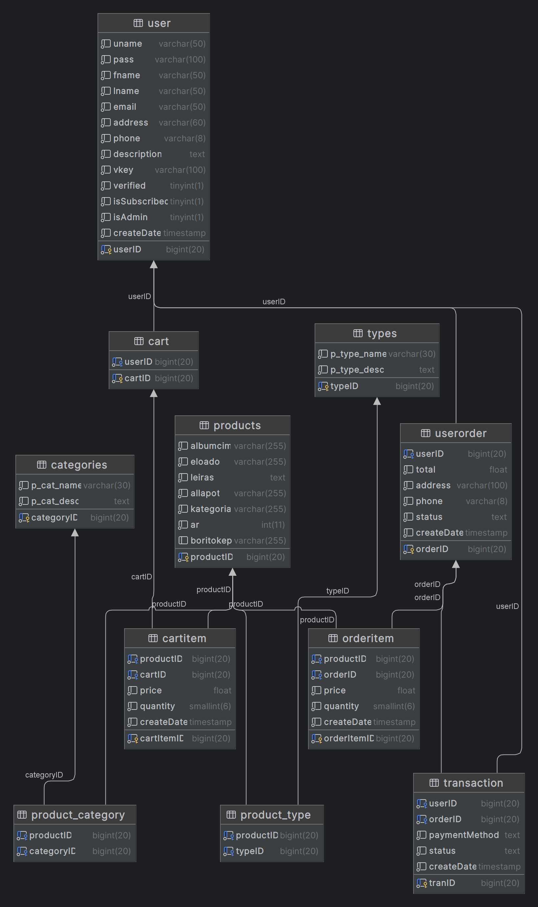

# Rendszerterv

## 1. Rendszer célja

Egy olyan weboldal létrehozása, ahol az eladó bemutatkozhat, illetve az eladó bakelit lemezeit átlátható, letisztult formában értékesítheti a vevők számára, valamint lemezkészítési lehetőséget is felkínálhat.

Az oldal használatához egy regisztrált és e-mail címmel megerősített felhasználói fiók szükséges. Az űrlapon megadott adatokkal tud a felhasználó később bejelentkezni, hogy vásárlást tudjon indítani, valamint elfelejtett jelszó esetén jelszót helyreállítani. A regisztrációnál számítógépes robot szűrés is történik reCapcha megerősítéssel.

Kétféle felhasználói fiók van: 
- a megrendelőnk mint super user hozzáfér mindenhez, az adatbázishoz is és 
- a vevői fiók akik megrendelést is tudnak leadni

A sima látogatók csak böngészni tudnak az oldalon vagy kapcsolatba lépni az eladóval, de megrendelést nem tudnak leadni.

A lemezek valamint a felhasználók és a megrendelések egy adatbázisban vannak tárolva, ehhez csak megrendelőnknek van hozzáférése, hogy új termékeket tudjon felvinni, módosítani, törölni közvetlenül az adatbázisban is és a szükségtelen felhasználókat is törölni tudja. Ugyanakkor megrendelőnk jogosultságával a weboldalon keresztül is tud termékeket felvinni/módosítani/törölni ami közvetlenül az adatbázisba íródik.

## 2. Projekt terv

A projekt egy weboldal ami PHP alapokon nyugszik, de használ HTML, CSS, Bootstrap, JavaScript elemeket, valamint MySQL adatbázist a felhasználók, termékek és vásárlási adatok rögzítéséhez. Négy fejlesztő dolgozik egyszerre a megvalósításon, ezért a konfliktusok kezelésére projekt menedzsment és kollaborációs eszközöket használunk. 

A feladatok nyomonkövetésére a Trello-ban létrehozott https://trello.com/b/NcWPd94d/projectx felületet használjuk.

A folyamatos kommunikációhoz és a projekt megbeszélésekhez valamint az azonnali problémamegoldáshoz a Discord-on létrehozott projekt szervert használjuk. Az itt rendelkezésre álló eszközöket, úgymint chat, fájlmegosztás, képernyőmegosztás és telefon/videókonferencia hívás extenzíven támogatják a feladat megvalósítását.

A kódon végzett változtatásokat és az esetleges párhuzamosan végzett módosítások konfliktusait a GitHub használatával orvosoljuk és itt követjük nyomon a kódfejlesztés előrehaladását a https://github.com/EKKE-App-Dev-Lab/vinylmaster/branches oldalon.

## 3. Üzleti folyamatok modellje

### 3.1 Üzleti szereplők

A weboldalt regisztrálás nélkül is lehet használni. Ekkor a látogató csak a kezdőlapot és egyéb statikus tartalmakat
tartalamzó lapokat tud elérni. Dinamikus weboldalak közül csak a keresés funkciót tudja használni.
Regisztrált üzleti szereplők a vásárlók.

### 3.2 Üzleti folyamatok

Bejelentkezés minden felhasználó számára elérhető a megfelelő menüpont alatt:\
A ’Belépés’ ikonra kattinta megjelenik ’Felhasználó név’ és ’Jelszó’ beviteli űrlap. Ezek megadása után van lehetőség a
belépésre. Sikertelen belépésről figyelmeztető üzenetben tájékoztatja a felhasználót a weboldal. Ha a belépés sikeres a
felhasználó megkapja a belépett felhasználó jogait. 

#### Üzleti folyamatok regisztrálatlan felhasználó számára:

- Regisztráció a rendszerben:
  A még nem regisztrált vásárló regisztrál az oldalon. A regisztráció során az alábbi adatok megadása szükséges:

| Megnevezés         |
|--------------------|
| Felhasználónév     |
| Keresztnév         |
| Vezetéknév         |
| Email              |
| Jelszó             |
| Jelszó újra        |

Amennyiben megerősíti a felhasználó a regisztrációját az emailben kiküldött címen, regisztráltnak tekinthetjük a felhasználót.

A felhasználó jelszava adatvédelmi okokból hash algoritmus segítségével kerül tárolásra.

- Regisztrált felhasználó bejelentkezése:
A regisztrált felhasználónak lehetősége van bejelentkezni a rendszerbe a megfelelő adatok megadása után. Szükséges adatok: felhasználónév és jelszó.

### 3.3. Üzleti entitások

- hanghordozó (bakelit lemez)

## 4. Követelmények

Egy PHP-t futtatni képes webszerver MySQL adatbázissal, valamint e-mail küldéssel a regisztrációhoz, egy modern böngésző felület.

## 5. Funkcionális terv

### 5.1 Rendszerszereplők

### 5.2 Rendszerhasználati esetek

### 5.3 Menühierarchiák

A menürendszert egy, a weboldal fejléce alatt található vízszintes, lenyíló menüket is tartalmazó navigációs sávban építettük fel.

A menünek kétféle megjelenése van a megtekintő eszköz felbontásának függvényében, de a két menürendszer csak kinézetben tér el egymástól.

A rendszerbe való bejelentkezés előtt elérhető oldalak a menüből:
- Kezdőlap
- Termékek
- Készíts saját bakelitet
- Rólunk
- Kapcsolatfelvétel
- Bejelentkezés, csak ikonnal jelezve
  
A rendszerbe való bejelentkezés után elérhető oldalak a menüből:
- Bevásárolókosár, csak ikonnal jelezve. Ezen látszik az is, hogy hány terméket tartalmaz a kosár

Láblécben is találhatóak további menüpontok, amelyek minden eszközön elérhetőek, ezek a következőek:
- Adatkezelési tájékoztató
- Felhasználói feltételek

### 5.4 Képernyőtervek

A Vinylmaster webshop tervezési folyamata azzal kezdődött, hogy alaposan feltérképeztük a bakelit lemezek piacát, figyelembe véve az aktuális trendeket és a célcsoport igényeit. A kutatás eredményeként kialakítottuk a tervezés alapelveit, melyek közé tartozott a modern és fiatalos dizájn hangsúlyozása.

A design fázisában elsődleges szempontként kezeltük az élénk és vonzó színpaletta használatát, amely tükrözi a Vinylmaster dinamizmusát és innovatív hozzáállását. Az olvasható betűtípusok és az áttekinthető elrendezés kialakítása mellett a könnyen kezelhető és átlátható felületre helyeztük a hangsúlyt, hogy a látogatók gyorsan és egyszerűen megtalálhassák a keresett termékeket.

A funkcionalitás és esztétika szorosan összefonódott a tervezési folyamat minden szakaszában. A webshop felépítésénél odafigyeltünk arra, hogy az oldalak ne csak esztétikusak, hanem praktikusak is legyenek. Az egyszerű vásárlási folyamat és a logikus információelrendezés garantálják a zökkenőmentes felhasználói élményt.

Így született meg a Vinylmaster webshop, amely nem csupán egy online felület, hanem inspiráló tér is. A forma és a funkcionalitás harmonikusan egyesül ebben a modern, fiatalos és könnyen kezelhető webshopban, létrehozva ezzel egy kivételes vásárlási élményt a látogatók számára.

Főbb oldalak:

index.php, amely minden felhasználó számára először jelenik meg.

products.php, regisztrált és nem regisztrált felhasználók is ezen az oldalon böngészhetik a webshop kínálatát.

belepve.html, amely az adminisztrátor könyvtáros bejelentkezése után jelenik meg. Ez a kezdőoldal Belépés menüpontján keresztül elérhető.

Megjegyzések:

Adminisztrátori jogosultsággal nem rendelkező könyvtáros menürendszere annyiban tér el a fentitől, hogy a Könyvtáros menüpont nem szerepel az oldalán, mint az a Menühierarchia fejezetben is ismertetésre került.

Az Egyszerű keresés és az Részletes keresés oldalak elérhetők a kezdőlapról és belépést követően is, azonban a keresés eredménye oldalak a kezdőlapra visznek vissza, megváltozik a menürendszer, ez tekinthető a prototípus hiányosságának, azonban a keresési folyamatot így is demonstrálja a weboldal.

## 6. Fizikai környezet
Szerver oldalon egy Apache-ot, PHP-t és MySQL adatbázist futtatni képes operációs rendszer és az ehhez megfelelő hardverrel ellátott eszköz.

Kliens oldalon egy modern böngészőt futtatni képes operációs rendszerre van szükség (és ettől függően egy megfelelő hardverrel ellátott eszközre). Az oldal struktúrájáért a HTML, a megjelenítésért a CSS valamint Bootstrap és az interakciókért a JavaScript felelős.

## 7. Absztrakt domain modell

## 8. Architekturális terv

A rendszer folyamatosan bővíthető az eladó által. Új termékeket vihet fel, valamint módosíthatja és törölheti a meglévőket.

Biztonsági funkciók közé tartozik, hogy van adminisztrátori fiók. Az adminisztrátor minden regisztrált felhasználó adatát láthatja és kezelheti, kivéve a jelszót, mivel az titkosítva van eltárolva. Minden felhasználó csak a saját adatait módosíthatja.

## 9. Adatbázis terv

A Vinylmaster webshop által hazsnált MySQL adatbázis, a vinylmasterdb, egy olyan adatbázis-rendszer, amelyet úgy
terveztünk, hogy kezelje az online hanglemezbolt adatait. A struktúra több táblát tartalmaz, mint például products,
categories, product_category, types, product_type, user, cart, cartitem, userorder, orderitem, és transaction.

Ebben a rendszerben a products tábla tárolja az eladásra kínált hanglemezek adatait, beleértve az előadó nevét, az album
címét, leírását, állapotát, kategóriáját, árát, és a borító képét. A categories és types táblák különböző kategóriákat
és típusokat definiálnak, amelyeket aztán a product_category és product_type táblákon keresztül kapcsolnak össze a
termékekkel.

A user tábla a felhasználók adatait tárolja, beleértve a felhasználónevet, jelszót, nevet, e-mail címet, címet,
telefonszámot, és további információkat. A vásárlási folyamatot a cart, cartitem, userorder, orderitem, és transaction
táblák kezelik, amelyek a kosárba helyezett termékeket, a megrendeléseket és a tranzakciókat követik nyomon.

Az alábbi ábra mutatja az adatbázis felépítését:

## 10. Implementációs terv

## 11. Tesztterv

## 12. Telepítési terv

Helyi gépre való telepítés esetén a következőkre lesz szükség:
- Egy webszerver környezetre, ami tudja az Apache/PHP/MySQL hármast.
- Egy modern böngészőt futtatni képes operációs rendszer (és az ehhez megfelelő hardverrel ellátott eszköz).
- Egy modern böngésző.

Webtárhelyre való telepítés esetén a következőkre lesz szükség:
- Egy a Apache/PHP/MySQL hármast támogató tárhely.
- Egy program, amivel FTP kapcsolaton keresztül feltölthetők a webalkalmazás fájljai.
- Egy modern böngésző.

## 13. Karbantartási terv

A platform nem igényel jelentős karbantartást. Főként az adatok és az adatbázis szerver felügyeletével kapcsolatos teendők kapcsolódhatnak a karbantartáshoz. 
Bejövő adatbázis kéréseket monitorozni kell és esetenként optimalizálni, amennyiben nagy a terheltség.
Funkcionalitás bővítése esetén merülhetnek fel problémák, ezen problémák elkerülésének érdekében bővítés esetén precízen kell megtervezni az új verziókat.
